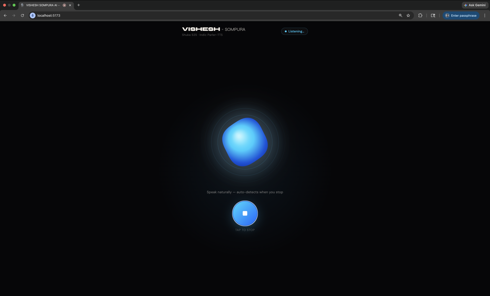

# VISHESH SOMPURA AI — Speech-to-Speech Voice Agent

A real-time Indian-language voice assistant powered by **Sarvam AI & Parler - TTS** S2T & T&S Model. Speak in any of 13+ Indian languages - agent listens, thinks, and speaks back naturally.



## Features

- **Voice Activity Detection** - auto-detects when you stop speaking
- **Hands-free conversation** - tap once, the agent loops: listen → think → speak → listen
- **13+ Indian languages** - Hindi, English, Tamil, Telugu, Bengali, Gujarati, Marathi & more
- **Animated VoiceOrb** - real-time audio-reactive visualization

## Quick Start

```bash
# 1. Install
npm install

# 2. Set up env
cp .env.example .env
# Add your Sarvam API key in .env

# 3. Run
npm run dev
```

Open **http://localhost:5173** - tap the mic and start speaking.

## How It Works

```
Mic → Sarvam STT (saaras:v3) → Sarvam LLM (sarvam-m) → Sarvam TTS (bulbul:v3) → Speaker
        auto-detect language       responds in same language     40+ Indian voices
```

## Optional: Local Parler-TTS

For higher-quality local voices (supports CUDA & Apple Silicon MPS):

```bash
cd tts
pip install -r requirements.txt
uvicorn parler_service:app --host 0.0.0.0 --port 8000
```

Set `PARLER_TTS_URL=http://localhost:8000` and `DEFAULT_TTS_PROVIDER=parler` in `.env`.

## Author

**Vishesh Sompura**

## 📄 License

Private
